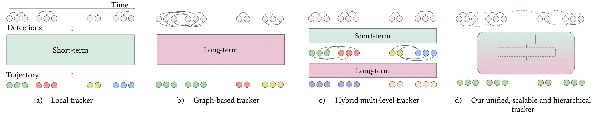

# Unifying Short and Long-Term Tracking with Graph Hierarchies :sushi:

Official repository of our **CVPR 2023** paper 

> [**Unifying Short and Long-Term Tracking with Graph Hierarchies**](https://openaccess.thecvf.com/content/CVPR2023/papers/Cetintas_Unifying_Short_and_Long-Term_Tracking_With_Graph_Hierarchies_CVPR_2023_paper.pdf)
> 
> [Orcun Cetintas*](https://dvl.in.tum.de/team/cetintas/), [Guillem Brasó*](https://dvl.in.tum.de/team/braso/), [Laura Leal-Taixe](https://dvl.in.tum.de/team/lealtaixe/)
> 
## Abstract
Tracking  objects over long videos effectively means solving a spectrum of problems, from short-term association for un-occluded objects to long-term association for objects that are occluded and then reappear in the scene. Methods tackling these two tasks are often disjoint and crafted for specific scenarios, and top-performing approaches are often a mix of techniques, which yields engineering-heavy solutions that lack generality. In this work, we question the need for hybrid approaches and introduce SUSHI, a unified and scalable multi-object tracker. Our approach processes long clips by splitting them into a hierarchy of subclips, which enables high scalability. We leverage graph neural networks to process all levels of the hierarchy, which makes our model unified across temporal scales and highly general. As a result, we obtain significant improvements over state-of-the-art on four diverse datasets.

<p align="center"></p>


## Results
### MOTChallenge - Test Set
| Dataset    |  IDF1 | HOTA | MOTA | ID Sw. |
|------------|-------|------|------|-------|
|MOT17 - Public       | 71.5 | 54.6 | 62.0 | 1041 |
|MOT17 - Private      | 83.1 | 66.5 | 81.1 | 1149 |
|MOT20 - Public       | 71.6 | 55.4 | 61.6 | 1053 |
|MOT20 - Private      | 79.8 | 64.3 | 74.3 | 706 |

### DanceTrack - Test Set
| Dataset    |  IDF1 | HOTA | MOTA | AssA | DetA |
|------------|-------|------|------|-------|------|
|DanceTrack      | 63.4 | 63.3 | 88.7 | 50.1 | 80.1 |


### BDD - Test Set
| Dataset    |  mIDF1 | mMOTA | IDF1 | MOTA | ID Sw. |
|------------|-------|------|------|-------|------|
|BDD      | 60.0 | 40.2| 76.2 | 69.2 | 13626 |


## Setup

1. Clone and enter this repository
    ```
    git clone https://github.com/dvl-tum/SUSHI.git
    cd SUSHI
    ```

3. Create an [Anaconda environment](https://docs.conda.io/projects/conda/en/latest/user-guide/tasks/manage-environments.html) for this project:
    ```
    conda env create -f environment.yml
    conda activate SUSHI
    ```

3. Clone [fast-reid](https://github.com/JDAI-CV/fast-reid) (latest version should be compatible but we use [this](https://github.com/JDAI-CV/fast-reid/tree/afe432b8c0ecd309db7921b7292b2c69813d0991) version) and install its dependencies. The `fast-reid` repo should be inside `SUSHI` root:
    ```
    SUSHI
    ├── src
    ├── fast-reid
    └── ...
    ```

4. Download [re-identification model we use from fast-reid](https://drive.google.com/file/d/1MovixfOLwnnXet05JLIGPy-Ag67fdW-2/view?usp=share_link) and move it inside `SUSHI/fastreid-models/model_weights/`

5. Download [MOT17](https://motchallenge.net/data/MOT17/), [MOT20](https://motchallenge.net/data/MOT20/) and [DanceTrack](https://dancetrack.github.io/) datasets. In addition, prepare seqmaps to run evaluation (for details see [TrackEval](https://github.com/JonathonLuiten/TrackEval)). We provide an [example seqmap](https://drive.google.com/drive/folders/1LYRYPuNWIWWz-HXSjuqyX8Fz9fDunTRI?usp=sharing). Overall, the expected folder structure is: 

    ```
    DATA_PATH
    ├── DanceTrack
    │   └── ...
    ├── MOT20
    │   └── ...
    └── MOT17
        └── seqmaps
        │    ├── seqmap_file_name_matching_split_name.txt
        │    └── ...
        └── train
        │    ├── MOT17-02
        │    │   ├── det
        │    │   │   └── det.txt
        │    │   └── gt
        │    │   │   └── gt.txt
        │    │   └── img1 
        │    │   │   └── ...
        │    │   └── seqinfo.ini
        │    └── ...
        └── test
             └── ...

    ```


6. (OPTIONAL) Download [our detections](https://drive.google.com/drive/folders/1bxw1Hz77LCCW3cWizhg_q03vk4aXUriz?usp=share_link) and [pretrained models](https://drive.google.com/drive/folders/1cU7LeTAeKxS-nvxqrUdUstNpR-Wpp5NV?usp=share_link) and arrange them according to the expected file structure (See step 5).


## Training
You can launch a training from the command line. An example command for MOT17 training:

```
RUN=example_mot17_training
REID_ARCH='fastreid_msmt_BOT_R50_ibn'

DATA_PATH=YOUR_DATA_PATH

python scripts/main.py --experiment_mode train --cuda --train_splits mot17-train-all --val_splits mot17-train-all --run_id ${RUN}_${REID_ARCH} --interpolate_motion --linear_center_only --det_file byte065 --data_path ${DATA_PATH} --reid_embeddings_dir reid_${REID_ARCH} --node_embeddings_dir node_${REID_ARCH} --zero_nodes --reid_arch $REID_ARCH --edge_level_embed --save_cp
```
You can find specific commands and configurations [here](assets/per_dataset_commands.md).


## Testing
You can test a trained model from the command line. An example for testing on MOT17 training set:
```
RUN=example_mot17_test
REID_ARCH='fastreid_msmt_BOT_R50_ibn'

DATA_PATH=your_data_path
PRETRAINED_MODEL_PATH=your_pretrained_model_path

python scripts/main.py --experiment_mode test --cuda --test_splits mot17-train-all --run_id ${RUN}_${REID_ARCH} --interpolate_motion --linear_center_only --det_file byte065 --data_path ${DATA_PATH} --reid_embeddings_dir reid_${REID_ARCH} --node_embeddings_dir node_${REID_ARCH} --zero_nodes --reid_arch $REID_ARCH --edge_level_embed --save_cp --hicl_model_path ${PRETRAINED_MODEL_PATH}
```

Launching this experiment with our MOT17 Private model should result in: `90.826 IDF1`, `80.884 HOTA` and `91.953 MOTA`. 

You can find specific commands and configurations [here](assets/per_dataset_commands.md).

## Citation
If you use our work in your research, please cite our publication:

    @InProceedings{Cetintas_2023_CVPR,
        author    = {Cetintas, Orcun and Bras\'o, Guillem and Leal-Taix\'e, Laura},
        title     = {Unifying Short and Long-Term Tracking With Graph Hierarchies},
        booktitle = {Proceedings of the IEEE/CVF Conference on Computer Vision and Pattern Recognition (CVPR)},
        month     = {June},
        year      = {2023},
        pages     = {22877-22887}
    }


## Acknowledgements
We use the codebase of [TrackEval](https://github.com/JonathonLuiten/TrackEval) for evaluation. We thank the authors for their great work!
